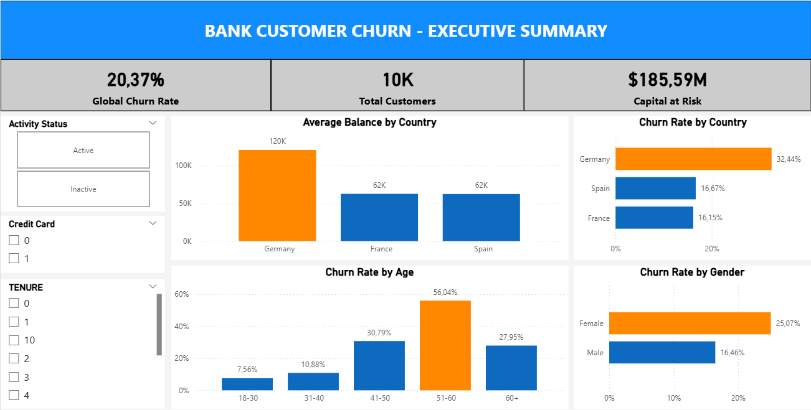

# 🏦 Bank Customer Churn Analysis: A Data-Driven Retention Strategy

## 📌 Project Overview

Customer attrition (churn) is one of the most critical metrics for financial institutions. This project aims to identify the root causes of customer churn in a European bank and quantify the financial impact of these lost accounts. By moving from isolated metrics to multivariate analysis, this project uncovers the "perfect storm" of churn drivers and provides actionable business recommendations to improve retention.

## 🎯 Business Objectives

* Identify demographic and geographic segments with the highest risk of churn.
* Discover behavioral patterns (e.g., account activity) that accelerate customer exit.
* Quantify the financial impact (Capital at Risk) to prioritize marketing and retention budgets.
* Build an interactive Executive Dashboard to monitor these KPIs.

## 🛠️ Tech Stack & Tools

* **Python:** Data Cleaning, Transformation, and EDA (Pandas, NumPy).
* **Jupyter Notebook:** Statistical validation and Multivariate Analysis.
* **Data Visualization:** Seaborn & Matplotlib (Heatmaps, Bar Charts).
* **Power BI:** Interactive Executive Dashboard, DAX Measures, and Data Modeling.

## 💡 Key Business Insights (The "Golden Nuggets")

1. **The Global Baseline:** The bank has an overall churn rate of **20.37%**.
2. **The Structural Flaw (Age):** Customers between **51-60 years old** represent a critical risk, with a churn rate exceeding **56%** globally.
3. **The Perfect Storm (Germany):** While Germany represents only 25% of the customer base, it acts as an accelerator for churn. The churn rate for **Inactive German customers** hits an alarming **41.08%**. When cross-referencing Country and Age, the churn rate for **German clients aged 51-60** skyrockets to **70.04%**.
4. **Financial Impact (Capital at Risk):** The analysis revealed a severe financial vulnerability. German customers not only churn at higher rates but also hold almost double the average account balance **(approx. $118k)** compared to clients in France and Spain  **(approx. $65k)** . The bank is losing its highest-value clients.

## 📊 Executive Dashboard

## 📁 Repository Structure

├── data/
│   ├── raw/
│   │   └── Churn_Modelling.csv          # Original dataset
│   └── processed/
│       └── bank_churn_processed.csv     # Cleaned dataset ready for Power BI
├── notebooks/
│   └── 02_eda_bank_churn.ipynb          # Exploratory Data Analysis & Statistical Validation
├── scripts/

│   └── 01_data_preparation.py           # Python script for data cleaning and feature engineering
├── dashboards/
│   ├── data_analysis.pbix               # Power BI Executive Dashboard
│   ├── data_analysis.pdf                # Static PDF version of the dashboard
│   └── dashboard_bank_churns.png        # Dashboard preview image
└── README.md


## 🚀 How to Run the Project

Follow these steps to reproduce the analysis and run the dashboard locally:

### 1. Prerequisites

Ensure you have **Python 3.x** installed and  **Power BI Desktop** .

### 2. Clone the Repository

**Bash**

```
git clone [https://github.com/seu-usuario/bank-churn-analysis.git](https://github.com/seu-usuario/bank-churn-analysis.git)
cd bank-churn-analysis
```

### 3. Set Up the Python Environment

Install the necessary data science libraries:

**Bash**

```
pip install pandas numpy matplotlib seaborn
```

### 4. Execute the Data Pipeline

Before opening the dashboard, you can run the data preparation script to understand how the features were engineered:

1. Run the cleaning script: `python scripts/01_data_preparation.py`
2. The processed file will be saved in `data/processed/bank_churn_processed.csv`.

### 5. Explore the Analysis

Open the Jupyter Notebook to see the statistical deep dive:

* Navigate to `notebooks/02_eda_bank_churn.ipynb`.

### 6. Open the Dashboard

Open the `dashboards/data_analysis.pbix` file using  **Power BI Desktop** .
*Note: If the data source path breaks, go to 'Transform Data' > 'Data Source Settings' and point it to the local CSV in `data/processed/`.*

## 💼 Strategic Recommendations

To stop the financial bleed, the bank must immediately deploy a targeted retention campaign focused on  **Germany** . Marketing efforts should prioritize **engagement strategies** for inactive clients and investigate product-market fit issues for the **51-60 age demographic** in that region.
